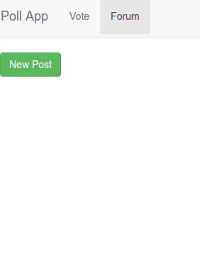
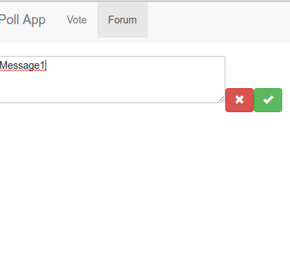
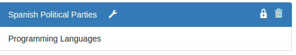
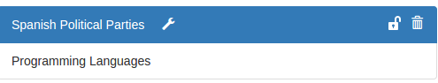
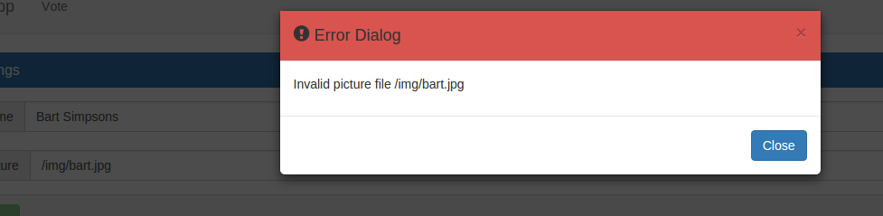
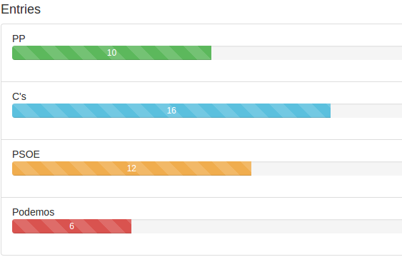
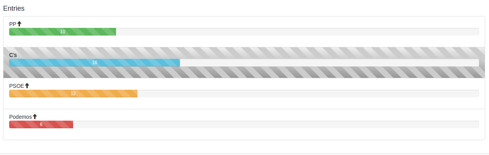
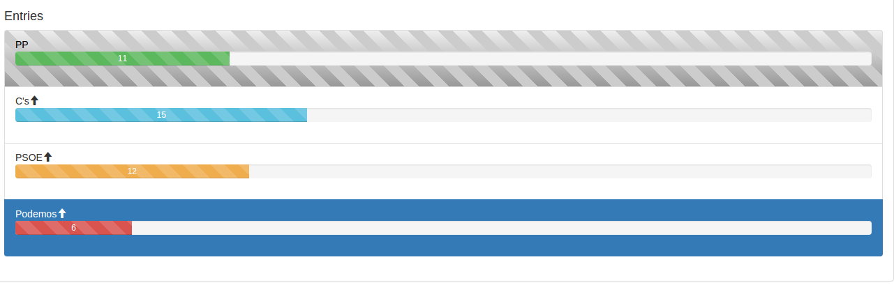
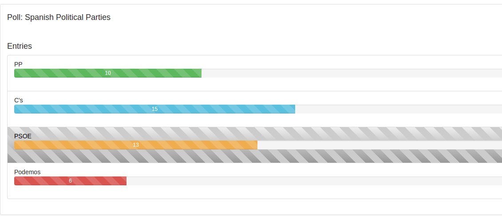
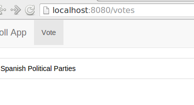

Examen Evaluación Final
=======================

# Día 07/03/2016 Tiempo: 5 horas

* Nota: Cada pregunta se valorará como bien o como mal (valoraciones intermedias serán excepcionales).
* Nota2: En cada pregunta se especifica si se valora en el examen de diseño o en el de desarrollo.
* Nota3: Para aprobar cada examen hay que obtener una puntuación mínima de 5 puntos en ese examen.
* Nota4: Organice su tiempo. Si no consigue resolver un apartado pase al siguiente. El examen consta ejercicios que se pueden resolver de forma independiente. Los apartados de diseño y de desarrollo también se pueden resolver por separado. Si un apartado depende de otro que no sabe resolver, siempre puede dar una solución que aunque no sea correcta, le permita seguir avanzando.
* Nota5: Para que una solución sea correcta, no sólo hay que conseguir que haga lo que se pide, sino que además todo lo que funcionaba lo tiene que seguir haciendo.
* Nota6: Lea completamente el examen antes de empezar y comience por lo que le parezca más fácil.

Pasos previos antes de empezar
------------------------------

* Clone el repositorio del enunciado

```bash
    git clone https://user-daw-zayas@bitbucket.org/surtich/polls-enunciado-final.git
```

* Vaya al directorio del repositorio

```bash
    cd polls-enunciado-final
```

* Configure su usuario de Git (es único para todos)

```bash
    git config user.name "user-daw-zayas"
    git config user.email "javier.perezarteaga@educa.madrid.org"
```

* Cree un *branch* con su nombre y apellidos separados con guiones (no incluya mayúsculas, acentos o caracteres no alfabéticos, excepción hecha de los guiones). Ejemplo:

```bash
    git checkout -b <fulanito-perez-gomez>
```

* Compruebe que está en la rama correcta:

```bas
    git status
```

* Suba la rama al repositorio remoto:

```bash
    git push origin <nombre-de-la-rama-dado-anteriormente>
```

* Instale las dependencias:

```bash
    npm install
```

* Arranque el servidor local de Firebase en un terminal dedicado:

```bash
    npm run start:firebase
```

* Para probar la solución, abra un nuevo terminal y ejecute:

```bash
    sudo npm install -g pushstate-server
    pushstate-server dist 9000
```

Navegue a [http://localhost:9000](http://localhost:9000)


* Ejecute su proyecto:

```bash
    npm start
```

* Navegue a la [raíz del proyecto](http://localhost:8080)


* Dígale al profesor que ya ha terminado para que compruebe que todo es correcto y desconecte la red.


## EXAMEN

#### 1- Ponga el nombre del usuario en la imagen del perfil.

#### 1.1- (0,5 puntos diseño) Al situarse encima del perfil del usuario se mostrará su nombre.



#### 1.2- (1 punto diseño) Si en Firebase no hay perfil para el usuario o el campo `name` en el perfil no existe o está vacío, se mostrará `anonymous`.




#### 2- Solo se podrán editar las `polls` en estado `locked`. Cuando el estado sea `unlocked` o `closed` no se podrá modificar ni borrar.

#### 2.1- (1 punto diseño) En `Poll Details`, oculte los botones que permiten las siguientes acciones:

* Eliminar una Poll.
* Modificar el título de una Poll.
* Añadir una entrada.
* Eliminar una entrada.



#### 2.2- En `My Polls`, el botón para borrar una `poll` siempre estará activo, pero si se pulsa sobre una `poll` con estado no `locked` se avisará.

Nota: Para la valoración de la parte de desarrollo (2.2.1 y 2.2.4), será obligatorio que se modifique el `store` de `Redux` haciendo algo similar a lo que se hace con los diálogos de confirmación.



#### 2.2.1- (1 desarrollo) Aparecerá un diálogo modal como el de la imagen.
#### 2.2.2- (1 punto diseño) El estilo será el mostrado.
#### 2.2.3- (0,5 puntos diseño) El mensaje será el que se muestra y contendrá el estado actual de la `poll` que se quiere borrar.
#### 2.2.4- (1 punto desarrollo) Al pulsar sobre `close`, sobre 'x' o en cualquier punto fuera del diálogo, se ocultará.


#### 3- En `settings` no se podrá almacenar el perfil del usuario si el fichero del campo `picture` no es válido.

Nota: Para comprobar si una imagen es válida puede utilizar la siguiente función:

```javascript
function imageExist(url) {
   const img = new Image();
   img.src = url;
   return img.height !== 0;
}
```

Nota2: Recuerde que si se deja en blanco el campo `picture` se borra este campo del perfil del usuario. Este comportamiento debe mantenerse.

#### 3.1- (2 puntos desarrollo) Cuando el fichero de imagen sea inválido, se mostrará un mensaje indicando el fichero incorrecto.

Nota: Será obligatorio reutilizar el diálogo y las acciones creadas en el ejercicio anterior.



#### 3.2- (1 punto diseño) A pesar de la comprobación anterior, es posible que la imagen del perfil sea accesible al modificar el perfil pero que no lo esté cuando el usuario se conecte (por ejemplo, porque se ha caído el servidor donde se almacenaba). Cuando la imagen no esté accesible, al conectarse un usuario, se mostrará la imagen de perfil por defecto.

Nota: Para probar esto, puede editar el fichero de datos manualmente poniendo una ruta inválida.

#### 4- Los usuarios no podrán votar más de una vez cada encuesta.

Nota: Supongo que esta es la pregunta que todos esperabais y que tendréis preparada :)

#### 4.1- (1 punto diseño) No se podrá votar a una encuesta cuando el usuario no esté conectado.



#### 4.2- (1 punto desarrollo) El voto se almacenará en Firebase.

Nota: Se debe almacenar la entrada a la que ha votado el usuario y no sólo aumentar el número de votos totales como se hace ahora.

#### 4.3- (1 punto diseño) Se impedirá que se pueda volver a votar una entrada y se cambiará el aspecto según la clase definida en `src/scss/_stripe.scss`.



#### 4.4- Se podrá cambiar el voto de una encuesta.



#### 4.4.1- (1 punto desarrollo) El cambio de voto se almacenará en Firebase, eliminando el voto anterior. La cuenta de votos será correcta.

#### 4.4.2- (1 punto diseño) Al cambiar el voto, cambiarán también los estilos para reflejar el nuevo voto. Cuando la encuesta esté cerrada no se podrá votar pero se reflejará el voto que, en su caso, hubiera hecho el usuario conectado.



#### 4.4.3- (1 punto desarrollo) Al votar o al cambiar el voto desde otro equipo (navegador), se reflejarán los cambios.

#### 5- Habrá una sección `My Votes`.

#### 5.1- (1 punto diseño) En el menú de usuario cree una sección `My Votes` que navegue a `/votes`.

#### 5.2- (2 puntos desarrollo) Al navegar a `/votes` se mostrará una lista con las encuestas en las que haya votado el usuario. Si no ha votado todavía en ninguna encuesta, se mostrará `No votes`.



#### 5.3- (1 punto diseño) Cada encuesta será un enlace que permitirá navegar a la votación de esa encuesta.


#### 6- (1 punto desarrollo) Cuando se recarga la aplicación con `F5` estando en `/poll` o en `/votes` no se muestran las `polls` del usuario ni las `polls` votadas respectivamente. La causa de este problema es que cuando se registra el `listener`, todavía no se sabe el `id` del usuario conectado. Puede arreglar este problema navegando a la raíz o esperado a que se cargue el usuario antes de registrar el `listener`, como prefiera.

Nota: Este apartado no se ha implementado en la solución.


Para entregar
-------------

* Ejecute el siguiente comando para comprobar que está en la rama correcta y ver los ficheros que ha cambiado:


```bash
    git status
```

* Prepare los cambios para que se añadan al repositorio local:

```bash
    git add --all
    git commit -m "completed exam"
```

* Compruebe que no tiene más cambios que incluir:

```bash
    git status
```

* Dígale al profesor que va a entregar el examen.

* Conecte la red y ejecute el siguiente comando:

```bash
    git push origin <nombre-de-la-rama>
```

* Abandone el aula en silencio.


Apéndice
-------------

# To create new token

```bash
	SECRET=<secret> USER=<user> npm run token
```

Example

```bash
    SECRET=sRhN4rw1LfRCN8BXS5zCNpo3odJAWhTvLXXT8edk USER=bart npm run token
```


And add the shown token to './src/utils/tokens.js'
