Examen Primera Evaluación
=========================

# Día 30/11/2015 Tiempo: 5 horas

* Nota: Cada pregunta se valorará como bien o como mal (valoraciones intermedias serán excepcionales).
* Nota2: En cada pregunta se especifica si se valora en el examen de diseño o en el de desarrollo.
* Nota3: Para aprobar cada examen hay que obtener una puntuación mínima de 5 puntos en ese examen.
* Nota4: Organice su tiempo. Si no consigue resolver un apartado pase al siguiente. El examen consta ejercicios que se pueden resolver de forma independiente. Los apartados de diseño y de desarrollo también se pueden resolver por separado. Si un apartado depende de otro que no sabe resolver, siempre puede dar una solución que aunque no sea correcta, le permita seguir avanzando.
* Nota5: Lea completamente el examen antes de empezar y comience por lo que le parezca más fácil.

Pasos previos antes de empezar
------------------------------

* Clone el repositorio del enunciado

```bash
    git clone https://user-daw-zayas@bitbucket.org/surtich/polls-enunciado-primera.git
```

* Vaya al directorio del repositorio

```bash
    cd polls-enunciado-primera
```

* Configure su usuario de Git (es único para todos)

```bash
    git config user.name "user-daw-zayas"
    git config user.email "javier.perezarteaga@educa.madrid.org"
```


* Cree un *branch* con su nombre y apellidos separados con guiones (no incluya mayúsculas, acentos o caracteres no alfabéticos, excepción hecha de los guiones). Ejemplo:

```bash
    git checkout -b <fulanito-perez-gomez>
```

* Compruebe que está en la rama correcta:

```bas
    git status
```

* Suba la rama al repositorio remoto:

```bash
    git push origin <nombre-de-la-rama-dado-anteriormente>
```

* Instale las dependencias:

```bash
    npm install
```

* Para probar la solución, abra un nuevo terminal y ejecute:

```bash
    sudo npm install -g pushstate-server
	pushstate-server dist 9000
```

Navegue a [http://localhost:9000](http://localhost:9000)


* Ejecute su proyecto:

```bash
    npm start
```

* Navegue a la [raíz del proyecto](http://localhost:8080)


* Dígale al profesor que ya ha terminado para que compruebe que todo es correcto y desconecte la red.


## EXAMEN

## 1.- La navegación se hará mediante un menú.

#### 1.1.- (2 puntos, diseño) Use menús de Boostrap con la apariencia de la imagen.

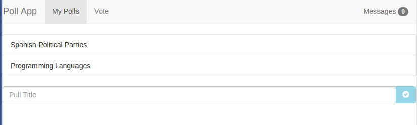

#### 1.2.- (0,5 puntos, desarrollo) Al pulsar una opción de menú quedará resaltada y se eliminará el resaltado de la anterior opción.

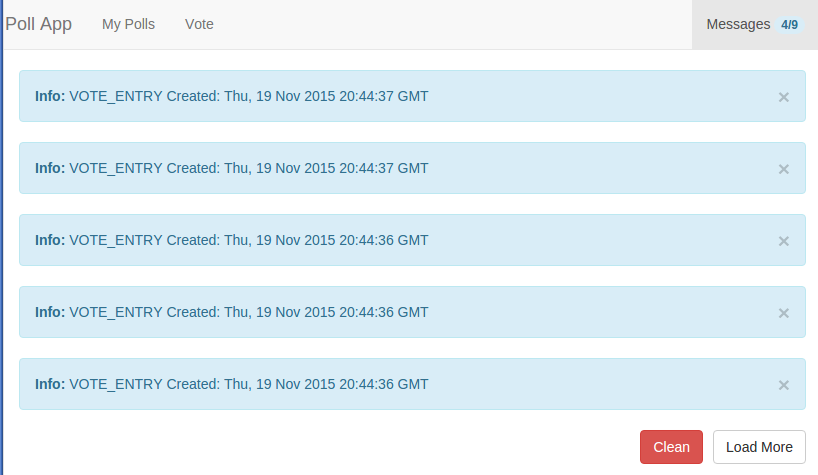

#### 1.3.- (0,5 puntos, difícil-desarrollo) La opción `My polls` estará resaltada tanto al navegar a `/poll` (hecho en el apartado anterior) como al hacerlo a `/poll/:idPoll`.

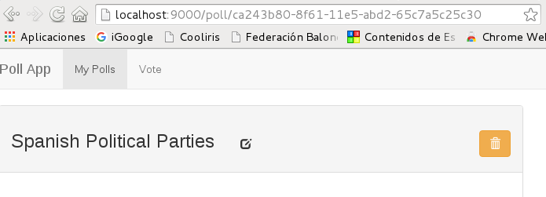

## 2.- (1 punto diseño) Modifique el estilo de `Poll Details`.

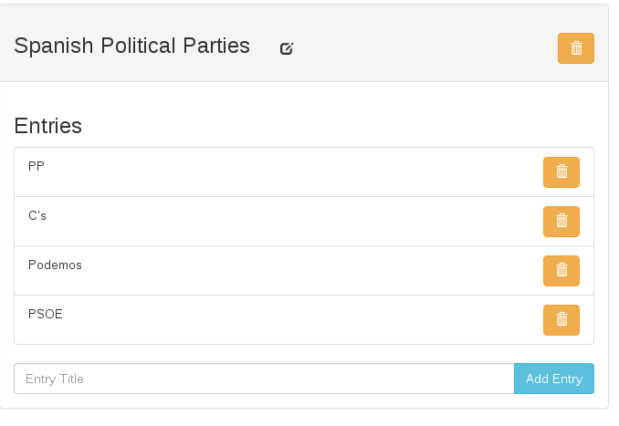

## 3.- Cree una sección para votar encuestas.

#### 3.1.- (1 punto, diseño) Al pulsar sobre la acción de menú `Vote` se navegará a `/vote` y se mostrará lo que se indica en la imagen.

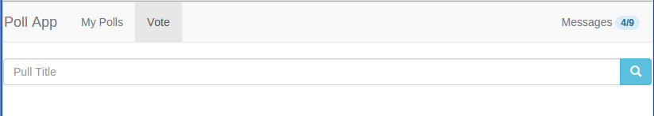

#### 3.2.- (1 punto, desarrollo) Al escribir sobre la caja de texto, se mostrarán los títulos de las `polls` que contengan ese texto sin distinguir mayúsculas de minúsculas.

#### 3.2Bis.- (1 punto, diseño) El estilo será el de la imagen.

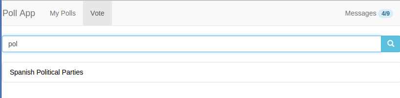

#### 3.3.- (0,5 puntos, desarrollo) Cuando no haya `polls` que contengan el texto, se indicará.

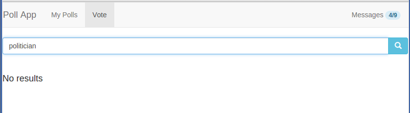

#### 3.4.- (0,5 puntos, desarrollo) No se mostrará nada cuando el texto sea inferior a tres caracteres.

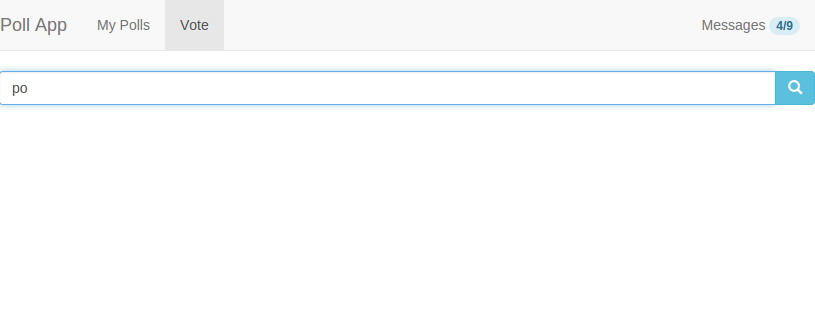

#### 3.5.- (3 puntos, diseño) Al pulsar sobre una `poll` se navegará a una sección que permitirá efectuar los votos con el siguiente aspecto.

Nota: Los votos se mostrarán en barras de progreso. Los colores de las barras se irán alternando.

#### 3.5Bis.- (2 puntos, desarrollo) Al pulsar sobre la flecha, se incrementarán los votos de esa entrada.

Nota: El porcentaje de la barra de progreso se calculará dividiendo el total de votos de esa entrada entre el total de votos de la encuesta.

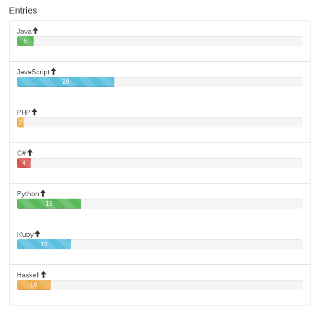

#### 3.6.- (0,5 puntos, desarrollo) Cuando se vote un `poll`, la acción se añadirá a notificaciones.

## 4.- Haga los siguientes cambios en notificaciones.

#### 4.1.- (2 puntos, diseño) El `badge` de mensajes será:

* Gris cuando no haya mensajes.
* Azul cuando haya nuevos mensajes.
* Verde cuando se hayan leído todos los mensajes.

Nota: En Bootstrap no existen las clases `badge-info` y `badge-success` por lo que debería crearlas.

#### 4.2.- (1 puntos, desarrollo) Cree un botón para borrar todos los mensajes.

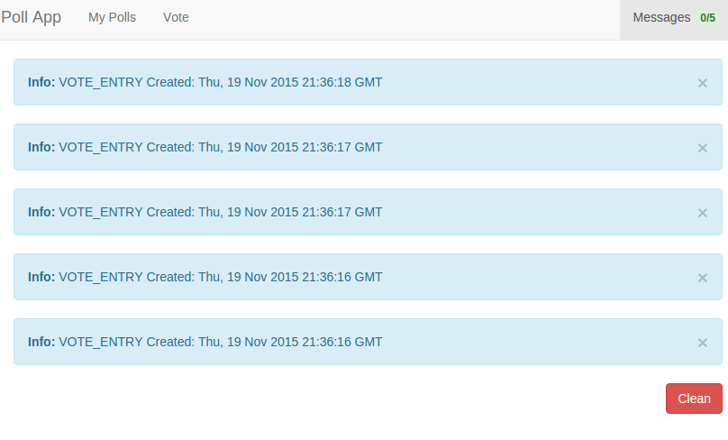

#### 4.3.- (1 puntos, desarrollo) Cuando no haya mensajes, no se mostrará el botón y en cambio se mostrará `No messages`.

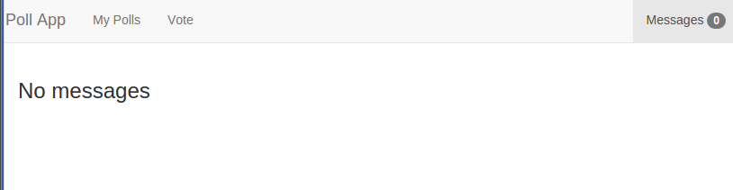

#### 4.4.- (1 punto, desarrollo) No se mostrarán más de 5 mensajes. Cuando haya más, se mostrarán los 5 últimos y un botón `Load More` que cargará los 5 anteriores (los mensajes se muestran en orden inverso).

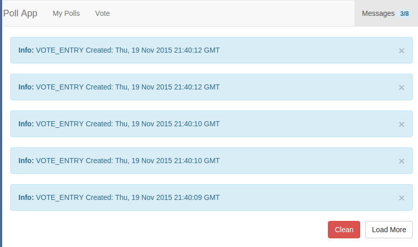

#### 4.5.- (0.5 puntos, desarrollo) Cuando no haya mensajes que mostrar no se verá el botón `Load More`.

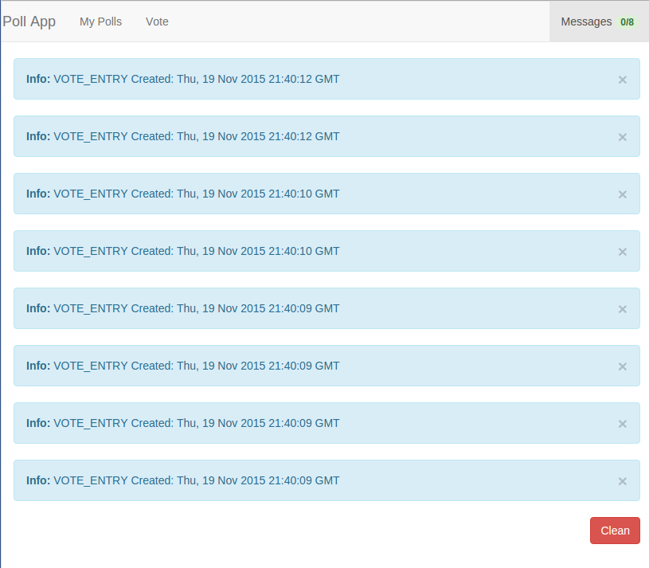

#### 4.6.- (1 punto, desarrollo - difícil) Haga que se contabilicen correctamente los mensajes vistos y que los `alerts` de los mensajes tengan el estilo correcto teniendo en cuenta el sistema de paginación.

Nota: Esto implicará una importante refactorización.


Para entregar
-------------

* Ejecute el siguiente comando para comprobar que está en la rama correcta y ver los ficheros que ha cambiado:

```bash
    git status
```

* Prepare los cambios para que se añadan al repositorio local:

```bash
    git add --all
    git commit -m "completed exam"
```

* Compruebe que no tiene más cambios que incluir:

```bash
    git status
```

* Dígale al profesor que va a entregar el examen.

* Conecte la red y ejecute el siguiente comando:

```bash
    git push origin <nombre-de-la-rama>
```

* Abandone el aula en silencio.
