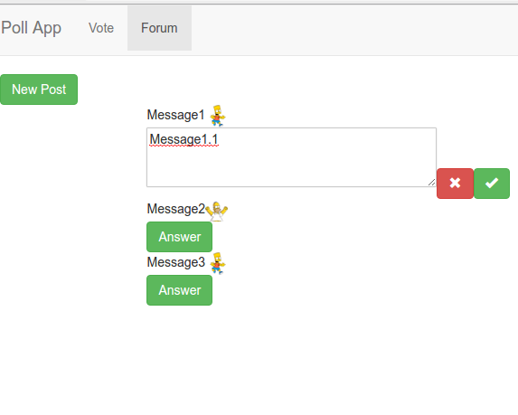

Examen Evaluación Final
=======================

# Día 20/05/2016 Tiempo: 4 horas

* Nota: Cada pregunta se valorará como bien o como mal (valoraciones intermedias serán excepcionales).
* Nota2: En cada pregunta se especifica si se valora en el examen de diseño o en el de desarrollo.
* Nota3: Para aprobar cada examen hay que obtener una puntuación mínima de 5 puntos en ese examen.
* Nota4: Organice su tiempo. Si no consigue resolver un apartado pase al siguiente. El examen consta ejercicios que se pueden resolver de forma independiente. Los apartados de diseño y de desarrollo también se pueden resolver por separado. Si un apartado depende de otro que no sabe resolver, siempre puede dar una solución que aunque no sea correcta, le permita seguir avanzando.
* Nota5: Para que una solución sea correcta, no sólo hay que conseguir que haga lo que se pide, sino que además todo lo que funcionaba lo tiene que seguir haciendo.
* Nota6: Lea completamente el examen antes de empezar y comience por lo que le parezca más fácil.

Pasos previos antes de empezar
------------------------------

* Clone el repositorio del enunciado

```bash
    git clone https://user-daw-zayas@bitbucket.org/surtich/polls-enunciado-extra1.git
```

* Vaya al directorio del repositorio

```bash
    cd polls-enunciado-extra1
```

* Configure su usuario de Git (es único para todos)

```bash
    git config user.name "user-daw-zayas"
    git config user.email "javier.perezarteaga@educa.madrid.org"
```

* Cree un *branch* con su nombre y apellidos separados con guiones (no incluya mayúsculas, acentos o caracteres no alfabéticos, excepción hecha de los guiones). Ejemplo:

```bash
    git checkout -b <fulanito-perez-gomez>
```

* Compruebe que está en la rama correcta:

```bas
    git status
```

* Suba la rama al repositorio remoto:

```bash
    git push origin <nombre-de-la-rama-dado-anteriormente>
```

* Instale las dependencias:

```bash
    npm install
```

* Arranque el servidor local de Firebase en un terminal dedicado:

```bash
    npm run start:firebase
```

* Para probar la solución, abra un nuevo terminal y ejecute:

```bash
    sudo npm install -g pushstate-server
    pushstate-server dist 9000
```

Navegue a [http://localhost:9000](http://localhost:9000)


* Ejecute su proyecto:

```bash
    npm start
```

* Navegue a la [raíz del proyecto](http://localhost:8080)


* Dígale al profesor que ya ha terminado para que compruebe que todo es correcto y desconecte la red.


## EXAMEN

#### 1- Se trata de hacer un foro digital.

#### 1.1- (1 punto desarrollo) Al pulsar sobre la opción de menú `Forum` se navegará a la ruta `/forum` y se mostrará el botón de la imagen.


#### 1.2- (0,5 puntos desarrollo) Al pulsar sobre el botón, se ocultará y se mostrará el diálogo de la imagen.


#### 1.3- (0,5 puntos desarrollo) Al pulsar sobre el botón cancelar, se ocultará el diálogo y se volverá a mostrar el botón del apartado 1.1.

#### 1.4- (1 punto desarrollo) Al pulsar sobre el botón aceptar, se almacenará el mensaje que haya en la caja de texto.


#### 1.5- (1 punto desarrollo) Los mensajes almacenados se mostrarán según la imagen anterior. La información se actualizará en tiempo real.

#### 1.6- (1 punto desarrollo) Se alamacenará la información del usuario que ha escrito el mensaje y esta información aparecerá junto al mensaje.
Nota: Puede mostrar la imagen del usuario, el id o el nombre, como prefiera.


#### 1.7- (0,5 puntos desarrollo) Cuando el usuario no esté conectado, no se mostrará el botón que permite añadir nuevos mensajes.


#### 1.8- (0,5 puntos desarrollo) Cuando el usuario no esté conectado y no haya mensajes, se mostrará `No Posts`.


#### 1.9- Se podrán añadir respuestas a los mensajes creando una estructura jerárquica.


#### 1.9.1- (1 punto desarrollo) Los mensajes se mostrarán en forma multinivel.

#### 1.9.2- (1 punto desarrollo) Aparecerá un botón junto a cada mensaje y al pulsarlo se mostrará el diálogo del apartado 1.1.
Nota: Observe que el texto cambia a `Answer`



#### 1.9.3- (2 puntos desarrollo) Se podrá responder a cualquier nivel y se almacenará la respuesta.

Para entregar
-------------

* Ejecute el siguiente comando para comprobar que está en la rama correcta y ver los ficheros que ha cambiado:


```bash
    git status
```

* Prepare los cambios para que se añadan al repositorio local:

```bash
    git add --all
    git commit -m "completed exam"
```

* Compruebe que no tiene más cambios que incluir:

```bash
    git status
```

* Dígale al profesor que va a entregar el examen.

* Conecte la red y ejecute el siguiente comando:

```bash
    git push origin <nombre-de-la-rama>
```

* Abandone el aula en silencio.


Apéndice
-------------

# To create new token

```bash
	SECRET=<secret> USER=<user> npm run token
```

Example

```bash
    SECRET=sRhN4rw1LfRCN8BXS5zCNpo3odJAWhTvLXXT8edk USER=bart npm run token
```


And add the shown token to './src/utils/tokens.js'
