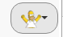
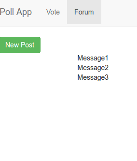
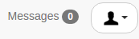
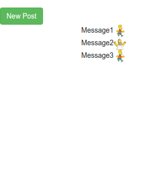
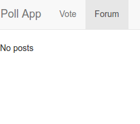
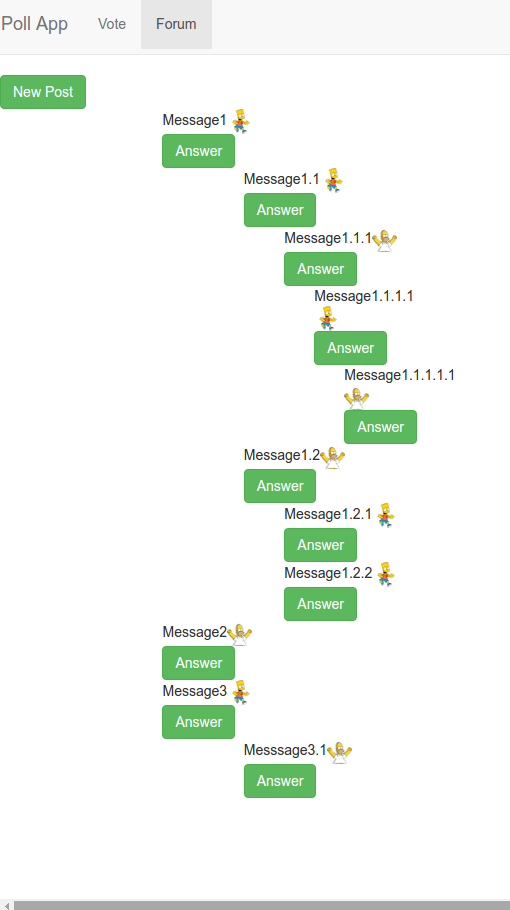
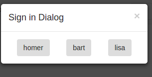
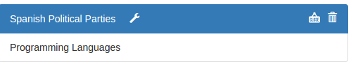
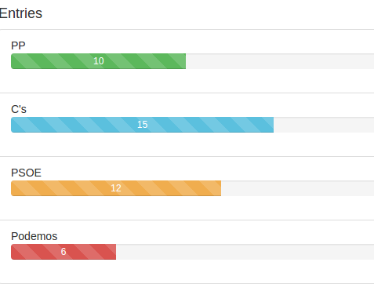

Examen Segunda Evaluación
=========================

# Día 22/02/2016 Tiempo: 5 horas

* Nota: Cada pregunta se valorará como bien o como mal (valoraciones intermedias serán excepcionales).
* Nota2: En cada pregunta se especifica si se valora en el examen de diseño o en el de desarrollo.
* Nota3: Para aprobar cada examen hay que obtener una puntuación mínima de 5 puntos en ese examen.
* Nota4: Organice su tiempo. Si no consigue resolver un apartado pase al siguiente. El examen consta ejercicios que se pueden resolver de forma independiente. Los apartados de diseño y de desarrollo también se pueden resolver por separado. Si un apartado depende de otro que no sabe resolver, siempre puede dar una solución que aunque no sea correcta, le permita seguir avanzando.
* Nota5: Para que una solución sea correcta, no sólo hay que conseguir que haga lo que se pide, sino que además todo lo que funcionaba lo tiene que seguir haciendo.
* Nota6: Lea completamente el examen antes de empezar y comience por lo que le parezca más fácil.

Pasos previos antes de empezar
------------------------------

* Clone el repositorio del enunciado

```bash
    git clone https://user-daw-zayas@bitbucket.org/surtich/polls-enunciado-segunda.git
```

* Vaya al directorio del repositorio

```bash
    cd polls-enunciado-segunda
```

* Configure su usuario de Git (es único para todos)

```bash
    git config user.name "user-daw-zayas"
    git config user.email "javier.perezarteaga@educa.madrid.org"
```

* Cree un *branch* con su nombre y apellidos separados con guiones (no incluya mayúsculas, acentos o caracteres no alfabéticos, excepción hecha de los guiones). Ejemplo:

```bash
    git checkout -b <fulanito-perez-gomez>
```

* Compruebe que está en la rama correcta:

```bas
    git status
```

* Suba la rama al repositorio remoto:

```bash
    git push origin <nombre-de-la-rama-dado-anteriormente>
```

* Instale las dependencias:

```bash
    npm install
```

* Arranque el servidor local de Firebase en un terminal dedicado:

```bash
    npm run start:firebase
```

* Para probar la solución, abra un nuevo terminal y ejecute:

```bash
    sudo npm install -g pushstate-server
    pushstate-server dist 9000
```

Navegue a [http://localhost:9000](http://localhost:9000)


* Ejecute su proyecto:

```bash
    npm start
```

* Navegue a la [raíz del proyecto](http://localhost:8080)


* Dígale al profesor que ya ha terminado para que compruebe que todo es correcto y desconecte la red.


## EXAMEN

## 1.- Administración del perfil del usuario.

Observe que el fichero `src/utils/redux-polls-export.json`, que es la base de datos de Firebase, contiene un nuevo objeto para almacenar el perfil del usuario.

```json
  "users": {
    "homer": {
      "name": "Homer Simpson",
      "picture": "/img/homer.png"
    },
    "bart": {
      "name": "Bart Simpson",
      "picture": "/img/bart.png"
     },
     "lisa": {
      "name": "Lisa Simpson"
     }
  }
```

El perfil de cada usuario se compone del nombre y opcionalmente la ruta a una imagen. Las imágenes están almacenadas en el fichero `dist/img`

#### 1.1.- Sustituya el botón `Sign out` por la imagen del perfil del usuario.

#### 1.1.1- (0,5 puntos diseño) Por pintar una imagen.
#### 1.1.2- (1 punto desarrollo) Por leer la ruta de la imagen del perfil del usuario.


#### 1.1.3- (0,5 puntos diseño) La imagen será un `menú desplegable` de Bootstrap.


#### 1.1.4- (0,5 puntos diseño) El botón será redondeado.



#### 1.1.5- (1 punto diseño) Al pulsar sobre el botón se mostrarán las opciones de menú siguientes:



#### 1.2.- (0,5 puntos diseño) Cuando el usuario no tenga campo `picture` en su perfil, se mostrará la imagen por defecto que está en `dist/img/user.png`.

Nota: No es una solución válida modificar la base de datos para grabar en el perfil del usuario la imagen por defecto.

.

#### 1.3.- (1 punto diseño) Elimine el menú `My Polls` del menú principal y haga que al pulsar `My Polls` en el perfil del usuario se navegue a las encuestas del usuario. El menú `Logout` desconectará al usuario de la sesión


#### 1.4.- Al pulsar sobre `Settings` se navegará a una página que permitirá ver y modificar el perfil del usuario.



#### 1.4.1- (1 punto diseño) Por conseguir el aspecto de la imagen.

#### 1.4.2- (1 punto desarrollo) Por leer correctamente el perfil del usuario y cargarlo en las cajas de texto.

#### 1.4.3- (1 punto desarrollo) Al pulsar sobre el botón `Save` se almacenará el perfil del usuario.

#### 1.4.4- (1 punto desarrollo) Al recargar la página, pulsado `F5`, se tiene que seguir viendo el perfil y la imagen del usuario conectado.

#### 1.4.5- (1 punto desarrollo) Al modificar la imagen del perfil desde la propia sesión o desde otra, se mostrará la nueva imagen en el botón del menú principal.

#### 1.4.6- (1 punto diseño) El botón `Save` estará deshabilitado mientras no se hagan cambios. Al pulsar sobre el botón `Save` éste se volverá a deshabilitar.


#### 1.4.7- (1 punto diseño) Al pulsar sobre `Save`, se mostrará el estado de espera. Cuando los cambios se hayan realizado se volverá al estado anterior.



#### 1.5.- (1 punto desarrollo) Si el campo `picture` se deja en blanco, en la base de datos no se almacenará este campo y si existiera, se borrará. En este caso se mostrará inmediatamente la imagen por defecto (ver apartados 1.2 y 1.4.5)

#### 1.6.- (2 puntos diseño) Al navegar a `/sign-in` los usuarios se mostrarán distribuidos proporcionalmente al espacio del panel.





#### 1.7.- (3 puntos desarrollo. Puntos extra. DIFÍCIL, DEJAR PARA EL FINAL) Suponga que pueda haber muchos campos en el perfil del usuario y que frecuentemente se añaden otros nuevos. Se trata de implementar una solución que no repita código. Para ello se ha creado un fichero en `src/utils/profile.json` con la estructura del perfil. Cuando se navegue al perfil, se mostrará un formulario con los campos indicados en el fichero. Si el campo tiene como valor un `input` se mostrará en una caja de texto y si tiene un `array` se mostrará una lista desplegable. Todo debe seguir funcionando como en los apartados anteriores.

## 2.- Administración del estado de las encuestas.

Las encuestas podrán estar en los siguientes estados:

* locked: Estado bloqueado. Será el estado inicial.
* unlocked: Estado desbloqueado. Desde `locked` se podrá pasar a estado `unlocked`.
* closed: Estado cerrado. Estado final. Desde `unlocked` se podrá pasar a `closed` pero, una vez en este estado, ya no se podrá cambiar de estado.

#### 2.1.- (1 punto diseño) Al mostrar inicialmente una encuesta y al crearla, se mostrará el estado `locked`.

Nota: Puede usar la imagen que está en: `dist/img/locked.png`


#### 2.2.- (2 puntos desarrollo) Al pulsar sobre el estado de la encuesta, se irá modificando éste según se explica más arriba, cambiado de imagen. Los cambios serán persistentes.




#### 2.3.- (1 punto desarrollo) Las encuestas en estado `locked` no aparecerán en las búsquedas.

#### 2.4.- (1 punto desarrollo) Las encuestas en estado `closed` aparecerán en las búsquedas pero no permitirán nuevos votos.

Nota: Las encuestas con estado `unlocked` aparecerán en las búsquedas y permitirán votar.



Para entregar
-------------

* Ejecute el siguiente comando para comprobar que está en la rama correcta y ver los ficheros que ha cambiado:

```bash
    git status
```

* Prepare los cambios para que se añadan al repositorio local:

```bash
    git add --all
    git commit -m "completed exam"
```

* Compruebe que no tiene más cambios que incluir:

```bash
    git status
```

* Dígale al profesor que va a entregar el examen.

* Conecte la red y ejecute el siguiente comando:

```bash
    git push origin <nombre-de-la-rama>
```

* Abandone el aula en silencio.


Apéndice
-------------

# To create new token

```bash
	SECRET=<secret> USER=<user> npm run token
```

Example

```bash
    SECRET=sRhN4rw1LfRCN8BXS5zCNpo3odJAWhTvLXXT8edk USER=bart npm run token
```


And add the shown token to './src/utils/tokens.js'
